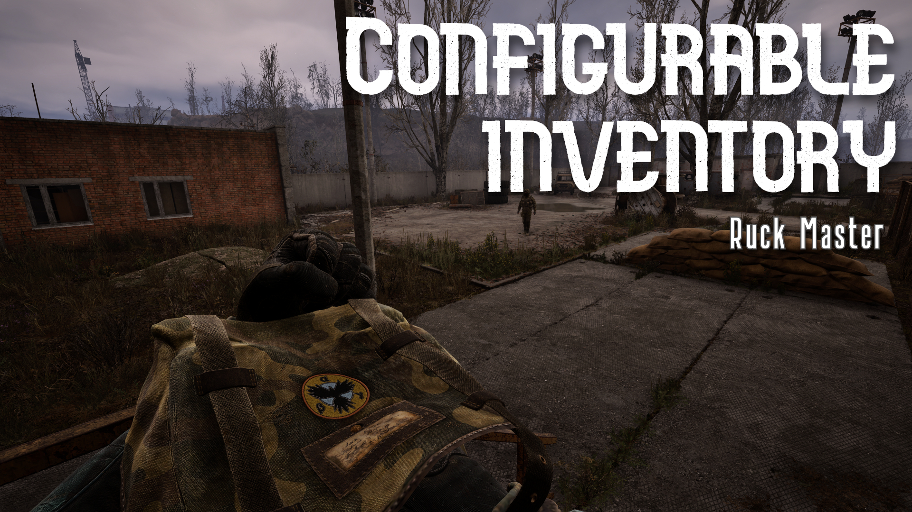
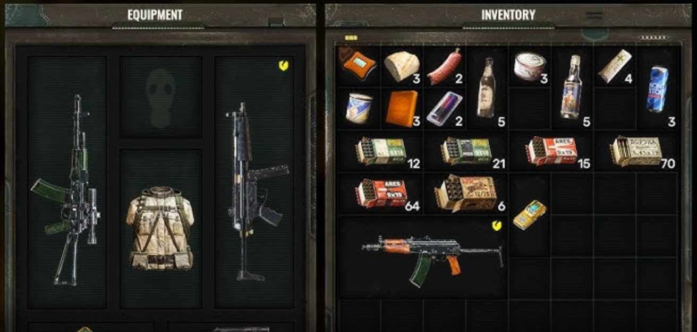
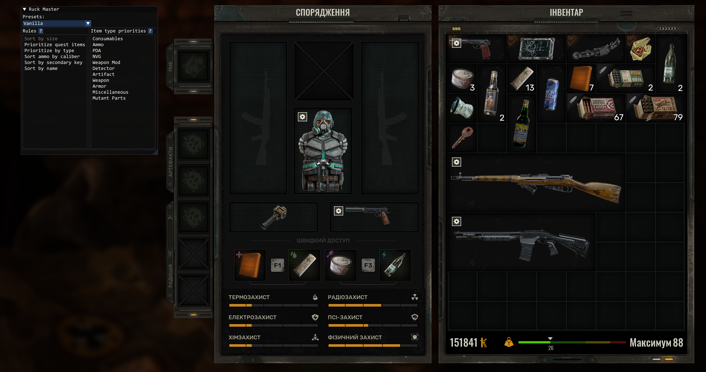
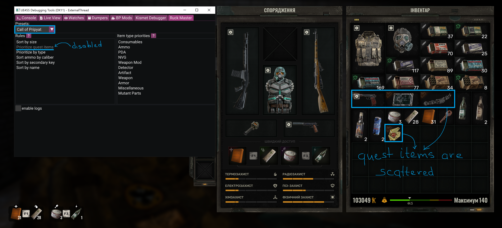
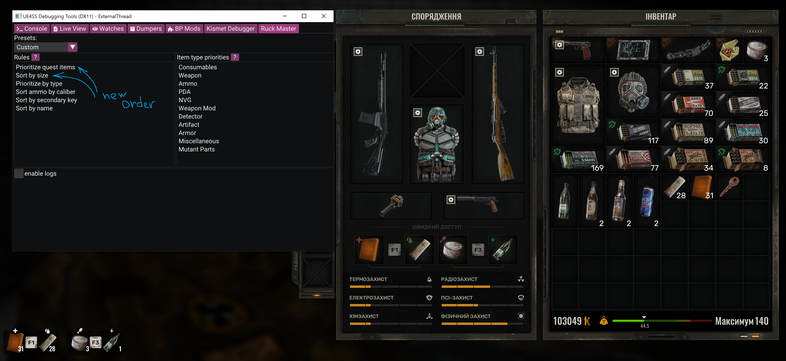

# Ruck Master — Advanced Inventory Sorting Mod for STALKER 2



**Ruck Master** is an advanced, fully configurable inventory sorting system for  
**S.T.A.L.K.E.R. 2: Heart of Chornobyl**, implemented as a **UE4SS C++ mod**.

It replaces the game's internal comparator with a modular, rule-based sorting pipeline  
that is fully customizable in real time via an ImGui UI panel.

This project provides:

- A complete re-implementation of the game’s item comparator in C++
- Modular sorting rules with deterministic ordering
- Drag-and-drop reordering of rules and item type priorities
- Live configuration via ImGui (accessible through UE4SS Debug Tools)
- Optional function call logging and original-comparator fallback
- Config presets (Vanilla, CoP-style, Custom) with runtime switching
- Saving/loading of the Custom preset via `.ini` file


## Motivation

The default inventory sorting in **S.T.A.L.K.E.R. 2** has several issues that make the inventory feel messy and inefficient.

Most importantly:

- After sorting, noticeable **“holes”** appear inside the grid.  
- Large items often end up placed between smaller ones, which in turn prevents optimal packing and creates even more gaps.
- The resulting layout feels inconsistent and wastes inventory space.



I remembered that **S.T.A.L.K.E.R.: Call of Pripyat** did not suffer from this problem — its sorting logic was far more structured and predictable.  
This led to the idea of **porting CoP’s comparator logic into STALKER 2**, rebuilding it from scratch, and extending it into a modular, configurable system.

For reference, [CoP’s original comparator can be found here](https://github.com/OpenXRay/xray-16/blob/ccfb30e45ddd9945ee49ce3dd8c0dc3ecd3038d6/src/xrGame/ui/UIInventoryUtilities.cpp#L61-L86).


The mod’s name, **Ruck Master**, is a direct homage to this classic implementation.

## Features

### Modular Sorting Rules
Each comparison step is an independent rule:
- Sort by size
- Prioritize quest items
- Prioritize by type
- Group ammo by caliber
- Sort by secondary key (durability, ammo metadata)
- Sort by name

You can reorder these rules freely, enable or disable each one individually,  
and instantly see the changes in the game's inventory UI.

### Type Priority Control
When "Prioritize by type" is enabled, a second list becomes active, allowing  
drag-and-drop reordering of all item type categories (weapon, ammo, artifact, etc).

### Presets
Three built-in presets:
- **Vanilla** — matches STALKER 2's default sorting behavior
- **CoP** — Call of Pripyat–style behavior (defined in code)
- **Custom** — fully editable; automatically saved to `ruck_master.ini`

### INI-based Persistence
Your custom configuration is saved automatically and restored on game load.


## Build Instructions

1. Install **Visual Studio 2022** with C++ and Windows SDK.
2. Clone the repo:
   ```bash
   git clone --recurse-submodules https://github.com/kacejot/s2-ruck-master
   ```
3. Configure CMake project:
   ```bash
   cd s2-ruck-master
   mkdir build && cd build
   cmake ..
   ```
4. After that locate .sln or .slnx file in your build folder, open it via VS2022 and build in `Release`

## Installation

### 1. Install UE4SS (Latest experimental release)

Download here: https://github.com/UE4SS-RE/RE-UE4SS/releases

Make sure UE4SS loads correctly before installing the mod.

### 2. Install Ruck Master

Create the mod folder structure:
```
S.T.A.L.K.E.R. 2 Heart of Chornobyl\Stalker2\Binaries\Win64\ue4ss\Mods\s2-ruck-master\dlls
```
Now place the mod DLL:

```
main.dll -> S.T.A.L.K.E.R. 2 Heart of Chornobyl\Stalker2\Binaries\Win64\ue4ss\Mods\s2-ruck-master\dlls
```

### 3. Place the configuration file (optional)

The mod will create and manage `ruck_master.ini` automatically in:
```
S.T.A.L.K.E.R. 2 Heart of Chornobyl\Stalker2\Binaries\Win64\ruck_master.ini
```

You can optionally place a template INI file from the repository to start with specific settings.

### 4. Enable the mod in UE4SS
Open:
```
S.T.A.L.K.E.R. 2 Heart of Chornobyl\Stalker2\Binaries\Win64\ue4ss\Mods\mods.txt
```

And add there a line with content:
```
s2-ruck-master: 1
```

So your file looks like this:
```
KismetDebuggerMod : 1
CheatManagerEnablerMod : 1
ActorDumperMod : 0
ConsoleCommandsMod : 1
ConsoleEnablerMod : 1
SplitScreenMod : 0
LineTraceMod : 1
BPML_GenericFunctions : 1
BPModLoaderMod : 1
jsbLuaProfilerMod : 0
s2-ruck-master: 1

; Built-in keybinds, do not move up!
Keybinds : 1
```

## Screenshots
Vanilla does have gaps between items, because item size is ignored.


So I added comparing by size from CoP and preset of the same name.<br>
And gaps are gone. But CoP ignored quest flag of the items.


If you want to change the order or enable/disable the rules, you still can do this in Custom preset:


## Credits

Reverse engineering, mod architecture, comparator design, UI, and implementation by **kacejot**.<br>
Analysis, naming, refactoring, and architectural guidance assisted by **ChatGPT**.

## License

MIT License — free to modify, fork, or integrate into other UE4SS mods.